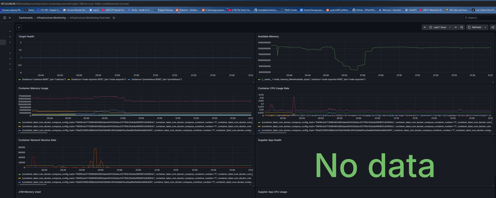
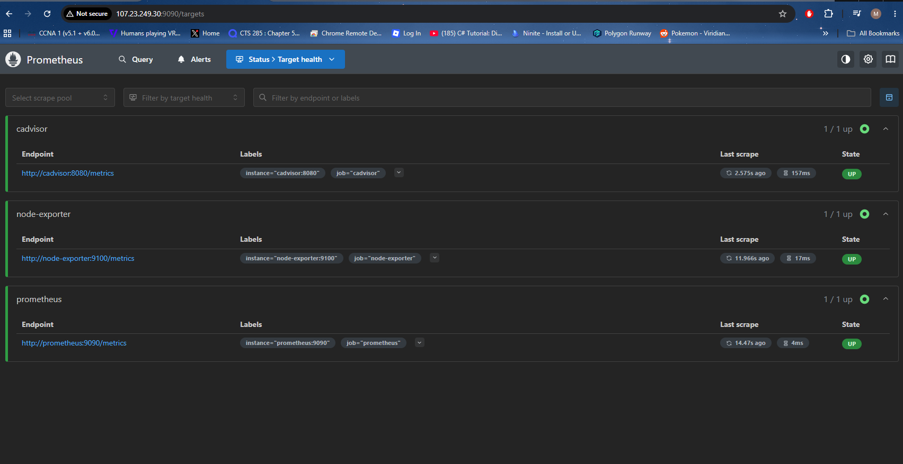
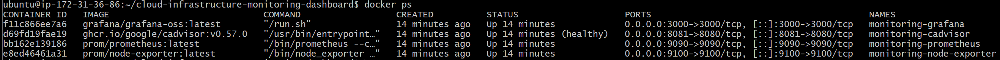
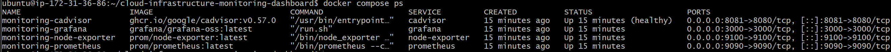
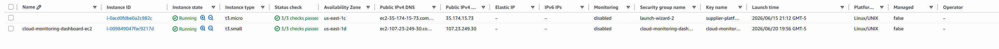
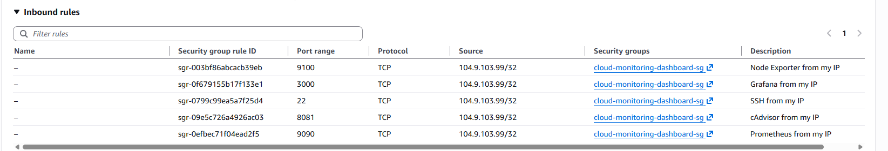
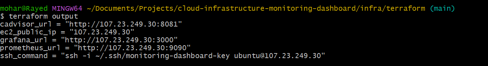

# Cloud Infrastructure Monitoring Dashboard

## Description

Cloud Infrastructure Monitoring Dashboard is a containerized monitoring platform used to track the health and performance of infrastructure, Docker containers, and backend applications.

The project uses Prometheus to collect metrics, Grafana to display dashboards, Node Exporter to monitor Linux server resources, and cAdvisor to monitor Docker containers. The stack can run locally using Docker Compose and can also be deployed to AWS EC2 using Terraform.

This project demonstrates real-world cloud and DevOps skills such as infrastructure monitoring, container observability, AWS deployment, infrastructure as code, and dashboard-based system troubleshooting.

---

## Technologies and Skills Used

* **AWS EC2** – Deployed the monitoring stack to a cloud server
* **Terraform** – Provisioned AWS infrastructure using infrastructure as code
* **Docker** – Containerized monitoring services
* **Docker Compose** – Managed multiple services in one stack
* **Prometheus** – Collected and stored infrastructure and application metrics
* **Grafana** – Created dashboards to visualize system health and performance
* **Node Exporter** – Collected Linux host metrics such as CPU, memory, disk, and network usage
* **cAdvisor** – Collected Docker container metrics such as CPU usage, memory usage, and network activity
* **Spring Boot Actuator** – Exposed backend application health and JVM metrics
* **Micrometer Prometheus** – Exported Spring Boot metrics in Prometheus format
* **Linux/Ubuntu** – Managed and deployed services on a Linux server
* **Git/GitHub** – Version-controlled project files, configurations, and documentation
* **AWS Security Groups** – Restricted access to SSH, Grafana, and Prometheus ports

---

## Services

### Prometheus

Prometheus collects metrics from the monitoring services and stores them as time-series data. It scrapes metrics from Node Exporter, cAdvisor, Prometheus itself, and the Spring Boot Actuator endpoint.

Prometheus is used to check whether services are running, inspect raw metrics, and provide data to Grafana dashboards.

---

### Grafana

Grafana visualizes the metrics collected by Prometheus. It displays dashboards for infrastructure health, container performance, memory usage, CPU usage, network traffic, and application metrics.

Grafana makes it easier to understand system performance without reading raw metric data manually.

---

### Node Exporter

Node Exporter collects Linux server metrics from the host machine. It provides visibility into system-level resources such as CPU, memory, disk usage, filesystem usage, and network activity.

In this project, Node Exporter helps monitor the health of the EC2 instance or local Linux environment.

---

### cAdvisor

cAdvisor monitors Docker containers and exposes container-level metrics. It tracks container CPU usage, memory usage, network traffic, and filesystem activity.

In this project, cAdvisor helps monitor the performance of containers running inside the Docker Compose stack.

---

### Spring Boot Actuator

Spring Boot Actuator exposes application health and performance metrics from the backend application. These metrics include application health, JVM memory usage, HTTP request counts, process CPU usage, and application readiness.

In this project, Actuator is used to demonstrate application-level monitoring alongside infrastructure and container monitoring.

---

### Terraform

Terraform provisions the AWS infrastructure required to run the monitoring stack. It creates the EC2 instance, security group rules, SSH key pair reference, and user data script for installing Docker.

Terraform makes the cloud infrastructure repeatable, version-controlled, and easier to recreate.

---

### AWS EC2

AWS EC2 hosts the monitoring stack in the cloud. The EC2 instance runs Ubuntu Linux and uses Docker Compose to run Prometheus, Grafana, Node Exporter, and cAdvisor.

This demonstrates how the monitoring platform can be deployed outside of a local development environment.

---

### AWS Security Groups

AWS Security Groups control inbound access to the EC2 instance. In this project, security group rules are used to restrict access to SSH, Grafana, Prometheus, cAdvisor, and Node Exporter ports.

This helps demonstrate basic cloud security practices by limiting access to trusted IP addresses.

---

## Screenshots

### Grafana Dashboard

### Prometheus Targets

### Docker Compose Running on AWS EC2

### AWS EC2 Instance

### AWS Security Group Rules

### Terraform Apply

